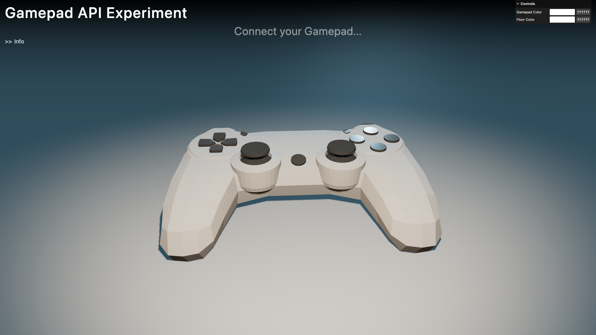

# Gamepad API Experiment

React / [Three.js](https://threejs.org/) / [react-three-fiber](https://docs.pmnd.rs/react-three-fiber/getting-started/introduction) & [Gamepad API](https://developer.mozilla.org/en-US/docs/Web/API/Gamepad_API)

## Demo

https://otaly.github.io/gamepad-api-experiment/

## Screenshot

by [otaly/readme-screenshot-action](https://github.com/otaly/readme-screenshot-action)

<!-- :README-SCREENSHOT-BEGIN: -->

<!-- :README-SCREENSHOT-END: -->
